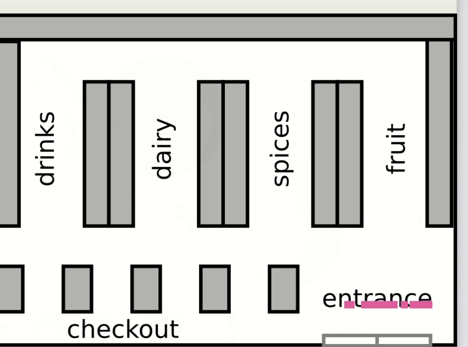

# Simulation-Project: Supermarket

This program simulates a supermarket where a specific number of people are allowed to go shopping at the same time. It is based on Markov-chains and has been created using numpy, pandas and cv2.

The EDA is rather for giving an overview over the data and generating ideas for further analyses.

This simulation of a Supermarket has been created in week 8 at Spiced Academy.

# To do:
- Fix bugs: some customers don't turn red at checkout, colours
- Implement: choose time of day/ weekday and revenue-counter
